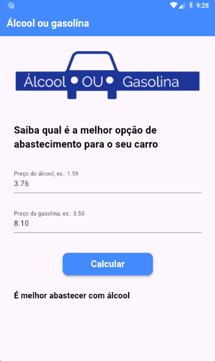

# 🚗 Fuel Choice Calculator – Flutter App

This is a simple mobile app developed using Flutter that helps users decide whether to refuel with **alcohol (ethanol)** or **gasoline**, based on price comparison.

---

## 📱 Screenshots



---

## 🛠️ Technologies Used

- Flutter
- Dart
- Material Design

---

## 💡 Features

- Intuitive and clean UI
- Text input fields for alcohol and gasoline prices
- Price validation with feedback
- Result message based on economic logic
- Responsive layout with scroll handling

---

## 🧠 Learning Outcomes

This project helped me learn and practice:

- `TextEditingController` for input management
- `double.tryParse()` and basic validation
- `setState()` to update the UI dynamically
- Clean layout with `Padding`, `Column`, `Image`, `TextField`, `Button`
- Simple decision-making logic in Dart

---

## 🚀 Getting Started

To run this app locally:

```bash
git clone https://github.com/your-username/your-repo-name.git
cd your-repo-name
flutter pub get
flutter run
